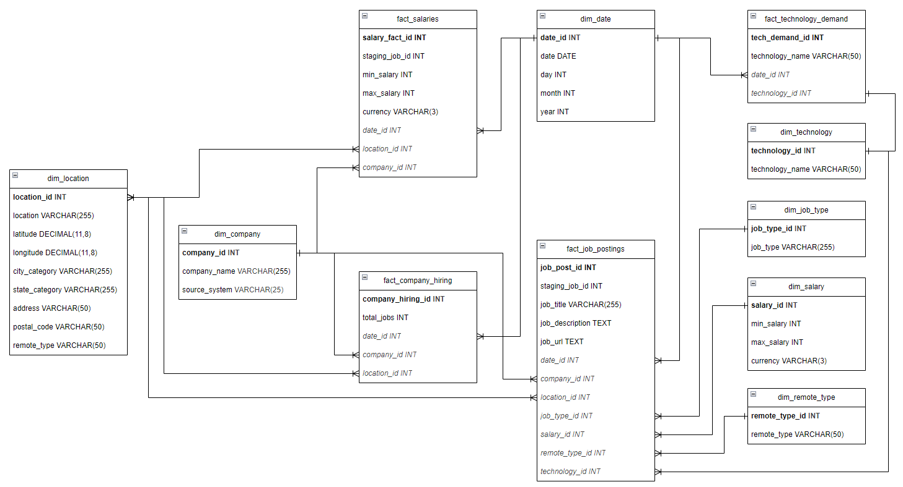
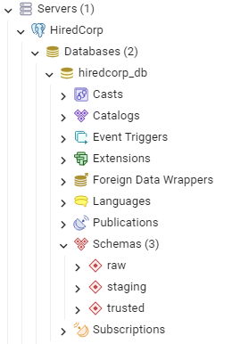

# Data warehouse modeling

## Business Area Definition
HiredCorp is a headhunting and workforce placement company that connects job seekers with employers. It operates by publishing job listings from its own contracts with companies and aggregating job postings from external sources.

### Business Requirements
HiredCorp's platform aggregates job postings from external sources (APIs) and provides insights into job trends, salaries, required skills, and hiring companies.

#### Core Business Goals
1. **Centralized Job Data** – Aggregate job postings from multiple PIs.
2. **Job Market Insights** – Track trends in job demand, required skills, and salaries.
3. **Company Analysis** – Identify which companies are hiring the most.
4. **Salary Trends** – Provide benchmarks for different job roles.
5. **Technology Popularity** – Determine which programming languages and tools are most in demand.
6. **Candidate & Employer Matching (Future Scope)** – Identify candidate fit based on job requirements.

#### Reports, Dashboards & KPIs
The main goal is to track hiring trends, job distribution, and market demand.

**Key Reports**
| Report Name |	Description |
| ----------- | ----------- |
| Job Distribution by Technology	| Shows the number of job postings for each technology (Python, AWS, SQL, etc.). |
| Job Openings by Company	| Ranks companies based on the number of job openings. |
| Job Openings by Location	| Analyzes job availability by city/state. |
| Salary Trends by Job Role	| Tracks salary ranges across job types. |
| Remote vs. Onsite Jobs	| Compares the percentage of remote, hybrid, and onsite jobs. |
| Job Growth Over Time	| Displays the trend of job postings over months/years. |

**Key Dashboards**
| Dashboard Name |	Option 1 | Option 2 | Option 3 | Option 4 |
| -------------- | ------------ | ------------ | ------------ | ------------ |
| Executive Dashboard | Total job postings (weekly/monthly trends) | % of remote vs. onsite jobs | Top hiring companies | Most in-demand technologies |
| Job Market Insights | Salary ranges by job title |  Growth trends for different job roles | Demand for technologies | - |
| Company Hiring Dashboard | Hiring patterns for specific companies | Time-to-fill job roles | Job types (contract, full-time, part-time) | - |

**Key KPIs**
| KPI |	Description |
| ----| ----------- |
| Total Job Postings | Count of job postings per day/week/month. |
| % Remote Jobs	| Percentage of remote job listings. |
| Average Salary by Role	| Average salary per job role (Software Engineer, Data Scientist, etc.). |
| Top 10 Hiring Companies	| List of companies posting the most jobs. |
| Technology Demand Index	| Percentage of job postings requiring a specific technology. |
| Growth Rate of Job Postings	| % change in job postings over time. |

## Warehouse Design
There will be created a server `HiredCorp` and a database named `hiredcorp_db`. For the database creation process consult [Data Engineering Introduction - Transform data](https://github.com/romanmurzac/DrivenPath/tree/main/chapter_2#transform-data).

### Source
The data sources for the company are:
* HiredCorp --> own platform data; vacancies and canditates posting.
* [DevITjobs](https://devitjobs.com/api/jobsLight) --> Platform for job posting.
* [Jobicy](https://jobicy.com/jobs-rss-feed) --> Platform for remote job posting.

In the `hiredcorp_db` database will be created a `raw` schema for *raw* layer. It will host four tables: `candidate`, `hiredcorp`, `devitjobs` and `jobicy`.

#### HireCorp source
For the own data there will be streaming ingestion. There will two tables:
* candidate --> candidates CVs.
* hiredcorp --> job posting from the partners.

**`candidate`**
* Stores candidate information
* Implemented SCD Type 2 for tracking candidate history

| Column Name | Data Type | Description |
| ------------| ----------------- | ----------- |
| candidate_id | INT PRIMARY KEY | Unique identifier (Standardized) |
| first_name | VARCHAR(50) | First name |
| last_name | VARCHAR(50) | Last name |
| age | INT | Age |
| gender | VARCHAR(50) | Gender |
| experience | INT | Years of experience |
| prefered_post | VARCHAR(50) | Position name |
| technologies | TEXT[] | Technologies |
| job_type | VARCHAR(50) | Job type |
| location | VARCHAR(50) | Location |
| is_available | BOOLEAN | If is available |
| available_from | TIMESTAMP | When is available |
| min_salary | INT | Minimum desired salary |
| source | VARCHAR(25) | Source from where data are ingested |
| created_at | TIMESTAMP | When the profile was created |
| ingested_ts | TIMESTAMP | When data was ingested |

**`hiredcorp`**
* Stores jobs information

| Column Name | Data Type | Description |
| ------------| ----------------- | ----------- |
| job_id | INT PRIMARY KEY | Unique identifier (Standardized) |
| source | VARCHAR(25) | Source of the job data |
| company_name | VARCHAR(255) | Unified company name |
| job_title | VARCHAR(255) | Unified job title |
| job_url | VARCHAR(500) |  Job URL |
| address | VARCHAR(255) | Address where the job is available |
| job_type | TEXT[]  | Job type (e.g., Full-time, Part-time) |
| min_salary | INT | Minimum salary |
| skills | TEXT[] | Technologies required for the job |
| posted_at | TIMESTAMP | Date job was published |
| ingested_ts | TIMESTAMP | When data was ingested |

#### External source
For the external sources the data will be ingested as full load daily. There will be ingested all fields as they are with coresponding data types. The description for each ingested field can be found on the provider side.\
**Note:** Please consult provider API for data details.

### Staging
In the `hiredcorp_db` database will be created a `staging` schema for *staging* layer. For the staging zone, a single unified staging `jobs` table will be designed that clean, standardize, and unify data from the two raw sources before moving it to the trusted zone. The staging schema will:
* Normalize fields across both sources
* Standardize data types and naming conventions
* Handle missing or inconsistent data
* Prepare for further transformation

| Column Name | Data Type | Description |
| ------------| ----------------- | ----------- |
| staging_id | INT PRIMARY KEY | Unique identifier (Standardized)
| job_id | TEXT | Unique identifier for a job
| source | VARCHAR(25) | Source of the job data
| job_url | VARCHAR(500) |  job URL
| job_title | VARCHAR(255) | Unified job title
| company_name | VARCHAR(255) | Unified company name
| company_logo | (500) | Company logo URL
| job_industry | TEXT[] | Industry categories (if available)
| job_type | TEXT[]  | Job type (e.g., Full-time, Part-time, etc.)
| job_level | VARCHAR(50) | Seniority level
| job_description | TEXT | Full job description
| job_excerpt | TEXT | Short job summary
| is_partner | BOOLEAN | Flag if is a partner
| is_paused | BOOLEAN | Flag if job is paused
| location | VARCHAR(255) | Standardized location (city/state/country)
| latitude | DECIMAL(11,8) | Latitude (if available)
| longitude | DECIMAL(11,8) | Longitude (if available)
| city_category | VARCHAR(50) | City where the job is available
| state_category | VARCHAR(50) | State where the job is available
| address | VARCHAR(255) | Address where the job is available
| postal_code | VARCHAR(50) | Postal code of the address
| remote_type | VARCHAR(50) | Remote type (e.g., "Remote", "Hybrid", "Onsite")
| workplace | VARCHAR(50) | Workplace type (e.g., "Office", "Home-based", etc.)
| candidate_contact_way | VARCHAR(50) | How to contact the company
| redirect_job_url | VARCHAR(500) | The URL to the job post
| salary_min | INT | Minimum salary (if available)
| salary_max | INT | Maximum salary (if available)
| salary_currency | VARCHAR(3) | Currency (USD, EUR, etc.)
| perk_keys | TEXT[] | Key words of the job
| company_size | VARCHAR(50) | Company size (e.g., "11-50 employees")
| company_type | VARCHAR(50) | Startup, Corporation, etc.
| tech_category | VARCHAR(50) | Category where the job fitting
| tech_stack | TEXT[] | Technologies required for the job
| filter_tags | TEXT[] | Extra filtering tags
| has_visa_sponsorship | BOOLEAN | Visa sponsorship availability
| language_requirements | TEXT[] | Required languages for the job
| published_at | TIMESTAMP | Date job was published
| last_update | TIMESTAMP | Last update timestamp
| ingested_ts | TIMESTAMP | Ingestion timestamp
| staging_ts | TIMESTAMP | Staging timestamp

### Bus Matrix
The Bus Matrix helps identify the key dimensions and facts required for reporting.

| Business Process | Date| Company| Technology | Location | Job Type | Salary | Form |
| ---------------- | --- | ------ | ---------- | -------- | -------- | ------ | ---- |
| Job Postings          | ✓ | ✓ | ✓ | ✓ | ✓ | ✓ | ✓ |
| Salary Trends         | ✓ | ✓ | ✓ | ✓ | ✗ | ✓ | ✗ |
| Technology Demand     | ✓ | ✓ | ✓ | ✗ | ✗ | ✗ | ✗ |
| Company Hiring Trends | ✓ | ✓ | ✗ | ✓ | ✓ | ✗ | ✗ |

### Dimensional Data Model
The dimensional model follows a Star Schema, optimized for analytics and for this will be created `trusted` layer in the `hiredcorp_db` database.

#### Fact Tables
| Fact Tables |	Description |
| ------------| ----------- |
| fact_job_postings | Stores job-related metrics. |
| fact_salaries | Captures salary details over time. |
| fact_technology_demand | Tracks tech demand across job postings. |
| fact_company_hiring | Analyzes company hiring trends. |

**`fact_job_postings`**
* Stores job-related metrics.
* Grain: Each row represents a unique job posting.
* Partitioning: By date_id for time-based analysis.
* Indexes: company_id, technology_id, location_id, job_type_id for efficient queries.

| Column Name | Data Type | FK Reference | Description | Availability in API |
| ----------- | --------- | ------------ | ----------- | ------------------- |
| job_post_id | BIGINT PRIMARY KEY | - | Unique job identifier | jobId |
| staging_job_id | INT staging(job_id) |	- | Unique job identifier | jobId |
| date_id | INT | dim_date(date_id) | Job posting date | publishedAt |
| company_id | INT | dim_company(company_id) | Hiring company| company.name |
| location_id | INT |	dim_location(location_id) | Job location| location |
| job_type_id | INT |	dim_job_type(job_type_id) | Full-time, part-time, etc. | employmentType |
| salary_id | INT |	dim_salary(salary_id) | Salary range | salaryMin, salaryMax |
| remote_type_id | INT | dim_remote_type(remote_type_id) | Remote, hybrid, onsite | remote |
| technology_id | INT |	dim_technology(technology_id) | Required technologies | tags |
| job_title | VARCHAR(255) | - |	Job title | title |
| job_description | TEXT | - |	Full job description | description |
| job_url | TEXT | - | Job posting link | url |

**`fact_salaries`**
* Salary Trends Over Time.
* Grain: Salary data grouped by job title, company, and location.

| Column Name | Data Type | FK Reference | Description | Availability in API |
| ----------- | --------- | ------------ | ----------- | ------------------- |
| salary_fact_id	| BIGINT PRIMARY KEY	| -	| Unique row identifier	| - |
| staging_job_id | INT | staging(job_id) | Unique job identifier | jobId |
| date_id	| INT	| dim_date(date_id)	| Salary date | publishedAt |
| job_title	| VARCHAR(255)	| -	| Job role | title |
| company_id	| INT	| dim_company(company_id)	| Company hiring for role | company.name |
| location_id	| INT	| dim_location(location_id)	| Job location| location |
| salary_id	| INT	| dim_salary(salary_id)	| Unique salary identifier | - |

**`fact_technology_demand`**
* Tracks job demand for each technology.
* Grain: Each row represents a job listing that requires a specific technology.

| Column Name | Data Type | FK Reference | Description | Availability in API |
| ----------- | --------- | ------------ | ----------- | ------------------- |
| tech_demand_id	| BIGINT PRIMARY KEY	| -	| Unique row identifier	| - |
| date_id	| INT	| dim_date(date_id)	| Date of job posting	| publishedAt |
| job_id	| BIGINT	| fact_job_postings(job_id)	| Related job posting | jobId |
| technology_id	| INT	| dim_technology(technology_id)	| Technology required | tags |

**`fact_company_hiring`**
* Tracks hiring activity per company.
* Grain: Aggregated at company and location level.

| Column Name | Data Type | FK Reference | Description | Availability in API |
| ----------- | --------- | ------------ | ----------- | ------------------- |
| company_hiring_id	| BIGINT PRIMARY KEY	| -	| Unique row identifier	| - |
| date_id	| INT	| dim_date(date_id)	| Hiring date	| publishedAt |
| company_id	| INT	| dim_company(company_id)	| Hiring company | company.name |
| location_id	| INT	| dim_location(location_id)	| Hiring location	| location |
| total_jobs	| INT	| -	| Count of job postings by company	| Aggregated |

#### Dimension Tables
| Dimension Table | Description |
| ----------------| ----------- |
| dim_date | Stores dates for time-based analysis. |
| dim_company | Stores company details. |
| dim_technology | Stores programming languages and tech stacks. |
| dim_location | Stores geographical details. |
| dim_job_type | Full-time, part-time, contract, etc. |
| dim_salary | Stores salary range classifications. |
| dim_remote_type | Remote, hybrid, onsite classification. |

**`dim_date`**
* Stores time-related data.
* Preloaded with a calendar of dates.

| Column Name | Data Type | Description |
| ----------- | --------- | ----------- |
| date_id | INT PRIMARY KEY	| Surrogate key |
| date	| DATE	| Full date |
| day	| INT	| Day of month |
| month	| INT	| Month number |
| year	| INT	| Year |

**`dim_company`**
* Stores hiring company data.

| Column Name | Data Type | Description | Availability |
| ----------- | --------- | ----------- | ------------ |
| company_id	| INT PRIMARY KEY	| Surrogate key	| - |
| company_name	| VARCHAR(255)	| Name of the company	| company.name |
| source_system | VARCHAR(25) | Source of the record | source |
| ingested_ts | TIMESTAMP | Time when record was ingested | - |

**`dim_location`**
* Stores job location details.

| Column Name | Data Type | Description | Availability |
| ----------- | --------- | ----------- | ------------ |
| location_id	| INT PRIMARY KEY	| Surrogate key	| - |
| city_category	| VARCHAR(50)	| City name	| location |
| state_category	| VARCHAR(50)	| State name | extracted |
| location | VARCHAR(255) | Location | location |
| latitude | DECIMAL(11,8) | Latitude | latitude |
| longitude | DECIMAL(11,8) | Longitute | longitude |
| address | VARCHAR(255) | Address | address |
| postal_code | VARCHAR(50) | Postal code | postal_code |
| remote_type | VARCHAR(50) | Remote type | remote_type |

**`dim_job_type`**
* Job type classification.

| Column Name | Data Type | Description | Availability |
| ----------- | --------- | ----------- | ------------ |
| job_type_id	| INT PRIMARY KEY	| Surrogate key	| - |
| job_type	| VARCHAR(255)	| Full-time, part-time, contract | employmentType |

**`dim_salary`**
* Salary classification.

| Column Name | Data Type | Description | Availability |
| ----------- | --------- | ----------- | ------------ |
| salary_id	| INT PRIMARY KEY	| Surrogate key	| - |
| min_salary	| INT	| Minimum salary	| salaryMin |
| max_salary	| INT	| Maximum salary	| salaryMax |
| currency	| VARCHAR(3)	| Currency	| currency |

**`dim_remote_type`**
* Remote vs. Onsite.

| Column Name | Data Type | Description | Availability |
| ----------- | --------- | ----------- | ------------ |
| remote_type_id	| INT PRIMARY KEY	| Surrogate key	| - |
| remote_type	| VARCHAR(50)	| Remote, Hybrid, Onsite | remote |

**`dim_technology`**
* Stores programming languages & tools.

| Column Name | Data Type | Description | Availability |
| ----------- | --------- | ----------- | ------------ |
| technology_id	| INT PRIMARY KEY	| Surrogate key	| - |
| technology_name	| VARCHAR(50)	| Tech name	| tags |

#### Entity Relatonship Diagram
For the ERD for database use the option from PgAdmin 4, on database choose option `ERD for Database` or use the file from `chapter_01/src/doc/entity_relationship_diagram.drawio`.\

#### Database schemas
To create the `raw` schema use the query from the file `chapter_01/src/layer/raw.sql`.\
To create the `staging` schema use the query from the file `chapter_01/src/layer/staging.sql`.\
To create the `trusted` schema use the query from the file `chapter_01/src/layer/trusted.sql`.\

### Physical Model

#### Partitioning
* Fact table `fact_job_postings` partitioned by *date_id*

#### Indexing
   * fact_job_postings_partitioned(job_id)
   * fact_job_postings_partitioned(company_id)
   * fact_job_postings_partitioned(location_id)
   * fact_job_postings_partitioned(technology_id)   

#### Data Quality
* Ensure non-null key fields
* Ensure salary consistency (currency in USD)
* Remove duplicate jobs (same job ID)
* Validate job postings have title