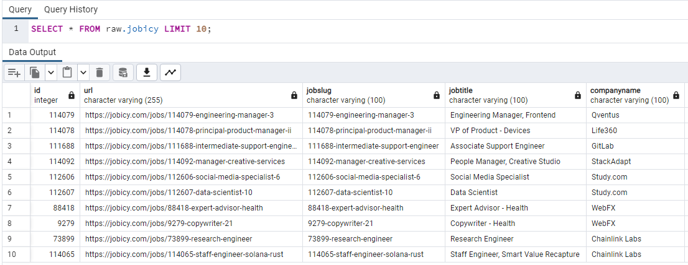
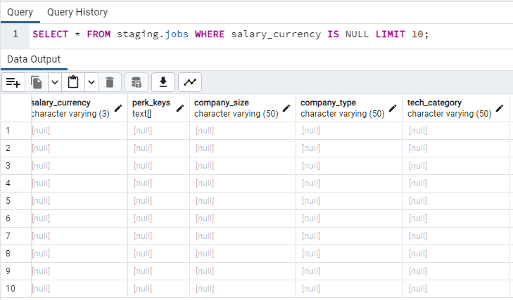
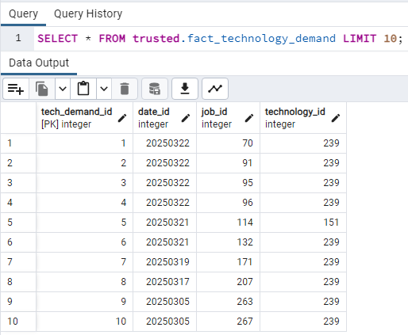

# Batch processing

## Source
In current phase the HiredCorp is using data from two partners and ingesting data from  their APIs named **Source 1** and **Source 2**.

### Source 1
Source 1 is [Jobicy](https://jobicy.com/) a Remote Jobs company.

#### API
The API's documentations is available [here](https://jobicy.com/jobs-rss-feed).

The company will make request to the API once per day at 08:00 AM UTC to the endpoint below.
```shell
https://jobicy.com/api/v2/remote-jobs
```

A sample of the result is shown below.
```json
{
  "apiVersion": "2.0",
  "documentationUrl": "https://jobi.cy/apidocs",
  "friendlyNotice": "We appreciate your use of Jobicy API in your projects!",
  "jobCount": 5,
  "xRayHash": "f34514999a794e106f0866e8fb0e6863",
  "clientKey": "c15cbfc379d0e662ad3655755eeb4989776166d0c2d2dd523493d8a0d6dd6319",
  "lastUpdate": "2025-03-15 02:50:57",
  "jobs": [
    {
      "id": 103940,
      "url": "https://jobicy.com/jobs/103940-customer-service-specialist",
      "jobSlug": "103940-customer-service-specialist",
      "jobTitle": "Community Support Engineer (AMER)",
      "companyName": "Exodus",
      "companyLogo": "https://jobicy.com/data/server-nyc0409/galaxy/mercury/2024/03/97caac3a-221.jpeg",
      "jobIndustry": [
        "Customer Success"
      ],
      "jobType": [
        "full-time"
      ],
      "jobGeo": "LATAM,  Canada,  USA",
      "jobLevel": "Any",
      "jobExcerpt": "Exodus receives hundreds of email messages daily from customers learning about digital assets.",
      "jobDescription": "<p>Exodus receives hundreds of email messages daily from customers learning about digital assets.</p>",
      "pubDate": "2025-03-14 03:54:10",
      "annualSalaryMin": 50000,
      "annualSalaryMax": 0,
      "salaryCurrency": "USD"
    }
  ]
}
```

#### Data
Retrieved data are loaded in the `jobicy` table in the `raw` schema.

### Source 2
Source 2 is [DevITjobs](https://devitjobs.com/) a Jobs company.

#### API
The API's documentations is available [here](https://devitjobs.com/api/jobsLight).

The company will make request to the API once per day at 08:00 AM UTC to the endpoint below.
```shell
https://devitjobs.com/api/jobsLight
```

A sample of the result is shown below.
```json
{
  "cpc": 3.11,
  "_id": "67bdbc2a2aa2fab4f077f3c4",
  "jobUrl": "Capgemini-Teamcenter-PLM-Administrator",
  "isPartner": true,
  "isPaused": false,
  "longitude": -79.37735244,
  "latitude": 43.6441709,
  "cityCategory": "Toronto",
  "stateCategory": "Canada",
  "logoImg": "https://d2q79iu7y748jz.cloudfront.net/s/_squarelogo/256x256/8df3e7301fa4f88e3d67e927be1689b2",
  "activeFrom": "2025-03-22T06:16:10.434+00:00",
  "candidateContactWay": "CompanyWebsite",
  "redirectJobUrl": "https://ca.indeed.com/tmn/ccs/e3f32dca22e5b3dd/cf97cb94dcbc4ed63499076eb94d494cfa250867e86a8a241ef1e74451ed7575/7985898892702321?sf=arD01",
  "remoteType": null,
  "workplace": "office",
  "company": "Capgemini",
  "address": "Bay Street 81",
  "actualCity": "Toronto",
  "postalCode": "M5B 2E5",
  "companyType": "Services",
  "companySize": "5k+",
  "hasVisaSponsorship": "No",
  "language": "English",
  "perkKeys": [],
  "name": "Teamcenter PLM Administrator",
  "jobType": "Full-Time",
  "expLevel": "Regular",
  "annualSalaryFrom": 40000,
  "annualSalaryTo": 65000,
  "techCategory": "Machine-Learning",
  "technologies": [
    "AI",
    "Cloud",
    "Hardware",
    "Support",
    "Linux",
    "Network",
    "Windows"
  ],
  "filterTags": [
    "Hardware",
    "Support",
    "Linux",
    "Network",
    "Windows",
    "AI",
    "Cloud"
  ]
}
```

#### Data
Retrieved data are loaded in the `devitjobs` table in the `raw` schema.

## Extract data
Data are extracted on demand by making a *POST* request to the API endpoint.
Based on the partnership, HiredCorp will extract data once per day in first 6 months with option to increase the extractions per day after this period.
Accessing API documentation of each partner investigate what data are available and make a description of the available fields and data type of each. In this case it will make reference always to the partner documentation directly. Still, there is a need to define which fields to be included in the extraction.

### Create infrastructure
In order to extract data from partner API to the company database there should be created necessary infrastructure. The server, database, and schemas are already created. Here is needed to add specific tables for each external source.

#### Source 1 table
In order to extract data from the Source 1, in the `raw` schema will be created a table named `jobicy`. For this use the SQL query from file `./raw/create_raw_jobicy.sql`.

#### Source 2 table
In order to extract data from the Source 2, in the `raw` schema will be created a table named `devitjobs`. For this use the SQL query from file `./raw/create_raw_devitjobs.sql`.

### Ingest data
In order to ingest data the **Python** programming language and **SQL** will be used.

#### Ingest Source 1
Using Python code from below there will be made a request.
```py
import request

response = requests.get("https://jobicy.com/api/v2/remote-jobs")
result = response.json()
jobs = result.get("jobs")
last_update = result.get("lastUpdate")
print(jobs, last_updated)
```

Using the SQL query from `./raw/insert_raw_jobicy.sql` the data will be ingested to the database.

For batch processing on daily basis use the script from `./extract/data_extractor_jobicy.py`. On each run this script will retrieve latest data from the API, will establish a connection with the database, and will append data to the table.

To view the result use the query from `./raw/select_raw_jobicy.sql`.\


#### Ingest Source 2
Using Python code from below there will be made a request.
```py
import request

response = requests.get("https://devitjobs.com/api/jobsLight")
result = response.json()
print(result)
```

Using the SQL query from `./raw/insert_raw_devitjobs.sql` the data will be ingested to the database.

For batch processing on daily basis use the script from `./extract/data_extractor_devitjobs.py`. On each run this script will retrieve latest data from the API, will establish a connection with the database, and will append data to the table.

To view the result use the query from `./raw/select_raw_devitjobs.sql`.\


## Transform data

### Move data
From `raw` schema the data are moved to `staging` schema by create one unified table named `jobs`. To create `jobs` table use the SQL query from `./staging/create_staging_jobs.sql`.

After creation of the table, insert data using the query from `./staging/insert_staging_jobs.sql`.

Now the data can be queried in the staging schema using the query from `./staging/select_staging_jobs.sql`.\


### Transform data
In first bach insertion there are 2209 records (job posts!).\


Using query from `./quality/remove_duplicates.sql` there will be removed duplicated job posts.\
Using query from `./quality/set_currency_consistency.sql` there will be set default currency as *USD*.\


Using query from `./quality/validate_job_title.sql` there will be removed job posts that doesn't contain a job title.\

## Load data
Load data is done in few phases. Load dim tables, load fact tables, create / update partitions, create / update indexes, and quality check.\


### dim_company
Using the query from `./trusted/create_dim_company.sql` create the table for **dim_company** in  `trusted` schema.\
Using the query from `./trusted/insert_dim_company.sql` load data into the table.\
Using the query from `./trusted/select_dim_company.sql` check data from the table.\


### dim_date
Using the query from `./trusted/create_dim_date.sql` create the table for **dim_company** in  `trusted` schema.\
Using the query from `./trusted/insert_dim_date.sql` load data into the table.\
Using the query from `./trusted/select_dim_date.sql` check data from the table.\


### dim_job_type
Using the query from `./trusted/create_dim_job_type.sql` create the table for **dim_company** in  `trusted` schema.\
Using the query from `./trusted/insert_dim_job_type.sql` load data into the table.\
Using the query from `./trusted/select_dim_job_type.sql` check data from the table.\


### dim_location
Using the query from `./trusted/create_dim_location.sql` create the table for **dim_company** in  `trusted` schema.\
Using the query from `./trusted/insert_dim_location.sql` load data into the table.\
Using the query from `./trusted/select_dim_location.sql` check data from the table.\


### dim_remote_type
Using the query from `./trusted/create_dim_remote_type.sql` create the table for **dim_company** in  `trusted` schema.\
Using the query from `./trusted/insert_dim_remote_type.sql` load data into the table.\
Using the query from `./trusted/select_dim_remote_type.sql` check data from the table.\


### dim_salary
Using the query from `./trusted/create_dim_salary.sql` create the table for **dim_company** in  `trusted` schema.\
Using the query from `./trusted/insert_dim_salary.sql` load data into the table.\
Using the query from `./trusted/select_dim_salary.sql` check data from the table.\


### dim_technology
Using the query from `./trusted/create_dim_technology.sql` create the table for **dim_company** in  `trusted` schema.\
Using the query from `./trusted/insert_dim_technology.sql` load data into the table.\
Using the query from `./trusted/select_dim_technology.sql` check data from the table.\


### fact_company_hiring
Using the query from `./trusted/create_fact_company_hiring.sql` create the table for **dim_company** in  `trusted` schema.\
Using the query from `./trusted/insert_fact_company_hiring.sql` load data into the table.\
Using the query from `./trusted/select_fact_company_hiring.sql` check data from the table.\


### fact_job_postings
Using the query from `./trusted/create_fact_job_postings.sql` create the table for **dim_company** in  `trusted` schema.\
Using the query from `./trusted/insert_fact_job_postings.sql` load data into the table.\
Using the query from `./trusted/select_fact_job_postings.sql` check data from the table.\


### fact_salaries
Using the query from `./trusted/create_fact_salaries.sql` create the table for **dim_company** in  `trusted` schema.\
Using the query from `./trusted/insert_fact_salaries.sql` load data into the table.\
Using the query from `./trusted/select_fact_salaries.sql` check data from the table.\


### fact_technology_demand
Using the query from `./trusted/create_fact_technology_demand.sql` create the table for **dim_company** in  `trusted` schema.\
Using the query from `./trusted/insert_fact_technology_demand.sql` load data into the table.\
Using the query from `./trusted/select_fact_technology_demand.sql` check data from the table.\


### Create Partitions
For partitioning by the fact table `fact_job_postings` by *date_id* use the SQL query from `./partition/create_fact_job_postings_partitioned.sql`.\
To create partitions use the SQL query from `./partition/create_fact_job_postings_partitions.sql`.

### Create Indexes
For indexes creation use the SQL queries from `./index/create_index.sql`. All that queries will create index for `fact_job_postings_partitioned` table on *job_id*, *company_id*, *location_id*, and *technology_id*.\


### Quality check
All queries from `./quality` can be used for quality check, to avoid redundancy use only `./quality/set_non_null_key.sql`.