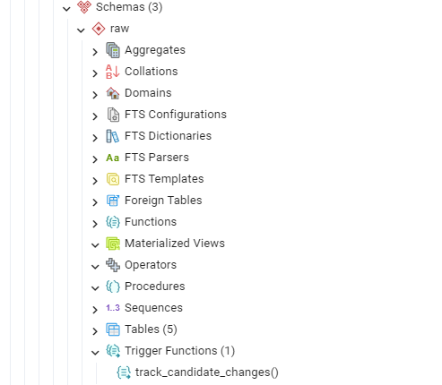
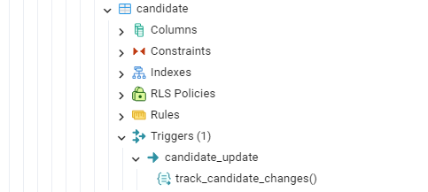
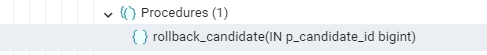
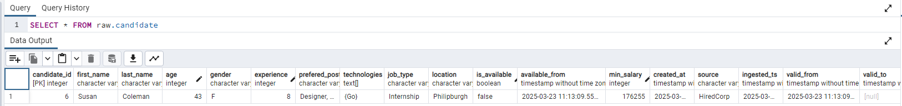
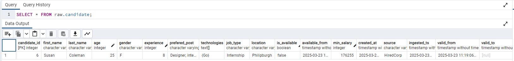
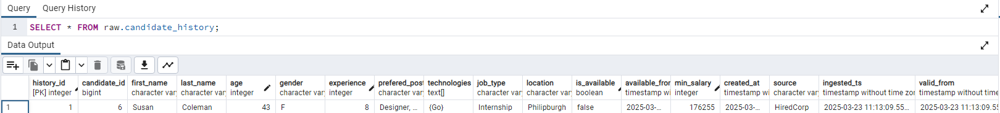
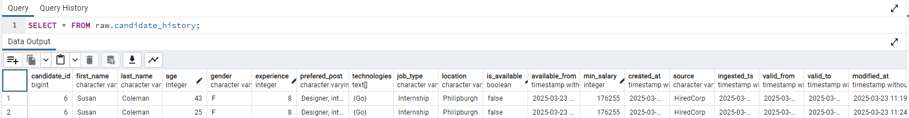

# Streaming processing

## Source
In current phase the HiredCorp is ingesting data from two different type of account: *company* and *candidate*.
Both tables where described in the design chapter. In the current chapter the infrastructure in the database will be created and data will be ingested in real time for both tables in the `raw` schema under the tables `hiredcorp` and `candidate`.

## Create infrastructure

## Setup streaming process

## Extract data

### Time travel and rollback
As there is a need to have the option for time travel and rollback for *candidate* table. It will be implemented by:
* update table schema
* create history table
* create trigger function
* attach trigger function
* create rollback procedure
* initial tables check
* call rollback procedure
* final tables check

#### Update *candidate* table
In order to enable time travel to the *candidate* table will be add two new columns `valid_from` and `valid_to`. To add these two columns, the table definition will be updated using the query from `./rollback/update_create_raw_candidate.sql` file.

#### Create *history* table
Create the candidate_history table in the `raw` schema using the query from `./rollback/create_history_raw_candidate.sql` file. It is a copy of the original table, but with two additional columns, `history_id` and `modified_at`, now there are 5 table in the schema.

#### Create trigger function
To create trigger function that will add the record to the history table when an update occur in the original table use the file `./rollback/create_trigger_function.sql`. In the `raw` schema in `Trigger Functions` section will apppear the newly created function - `track_candidate_changes()`.\


#### Attach trigger function
To attach the trigger function, use the query from `./rollback/attach_trigger_candidate.sql`. It will create a trigger named `candidate_update` and will attach to the original table.\


#### Create rollback procedure
Create a procedure that will be used for rollback. The rollback procedure will created using `./rollback/rollback_procedure_candidate.sql` file. After creation the procedure will be available under `Procedure` section in schema.\


#### Initial tables check
In order to make the it clear there will only one record inserted in the original table. Use the query from below to make sure that the table is empty.
```sql
TRUNCATE TABLE raw.candidate;
```

Run the job from `./extract/data_extractor_candidate.py` to insert one record in the *candidate* table and use query from below to see the result.
```sql
SELECT * FROM raw.candidate;
```


Update the `age` or any other field of the generated record using the query from below.
```sql
UPDATE raw.candidate
SET age = 25
WHERE candidate_id = 6;
```

Use the same query from the above to display the result of the *candidate* table again with updated value.\


Use the query from `./rollback/select_history_candidate.sql` file to query historical data for the *candidate* table. There will be inserted the initial version of the record.\


#### Call rollback procedure
In order to rollback the changes on the record use the query from `./rollback/call_rollback_candidate.sql` file.\

#### Final tables check
Execute again the query from `./rollback/select_history_candidate.sql` file to query historical data for the *candidate* table. The result will contain both version of the record.\


When query the *candidate* table the initial version of the record will be returned.\


## Transform data

## Load data

