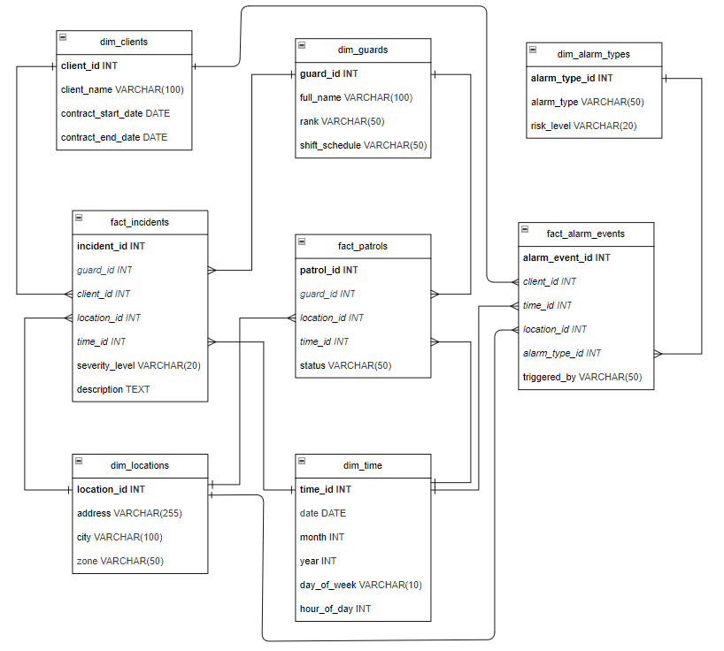

## Competency 5: Data warehouse modeling

### Overview
**SecureData** company provides surveillance, patrolling, and alarm monitoring services. The copmany need a centralized data warehouse to analyze:
- Security incidents.
- Patrol reports.
- Alarm triggers.
- Client contracts.
- Guard schedules and performance.
- Incident response times.

### Data Sources
The sources from where data are colected:
- **IoT Security Devices:** Cameras, alarms, motion detectors.
- **Incident Reports:** Manual entries by security personnel.
- **Employee Shift Schedules:** Guard working hours and locations.
- **Client Contracts:** Service agreements with customers.
- **External Crime Database:** Public crime statistics for risk analysis.

### Data Warehouse Design

#### Dimensional Design Process.
To be added ...

#### Schema Overview
The data warehouse follows a **star schema**, ensuring efficient querying and analytics.

#### Fact Tables:
- **Fact_Incidents:** Stores records of security incidents
  - incident_id (PK)
  - guard_id (FK to Dim_Guards)
  - client_id (FK to Dim_Clients)
  - location_id (FK to Dim_Locations)
  - time_id (FK to Dim_Time)
  - severity_level
  - description
- **Fact_Patrols:** Tracks security patrol logs
  - patrol_id (PK)
  - guard_id (FK to Dim_Guards)
  - location_id (FK to Dim_Locations)
  - time_id (FK to Dim_Time)
  - status
- **Fact_AlarmEvents:** Stores alarm trigger data
  - alarm_event_id (PK)
  - client_id (FK to Dim_Clients)
  - location_id (FK to Dim_Locations)
  - time_id (FK to Dim_Time)
  - alarm_type_id (FK to Dim_AlarmTypes)
  - triggered_by

#### Dimension Tables:
- **Dim_Guards:** Security personnel details
  - guard_id (PK)
  - full_name
  - rank
  - shift_schedule

- **Dim_Clients:** Information on clients
  - client_id (PK)
  - client_name
  - contract_start_date
  - contract_end_date

- **Dim_Locations:** Security coverage areas
  - location_id (PK)
  - address
  - city
  - zone

- **Dim_Time:** Time dimension for analytics
  - time_id (PK)
  - date
  - month
  - year
  - day_of_week
  - hour_of_day

- **Dim_AlarmTypes:** Types of alarms and triggers
  - alarm_type_id (PK)
  - alarm_type
  - risk_level

### Bus Matrix
| Fact Table     | Dim_Guards | Dim_Clients | Dim_Locations | Dim_Time | RigDim_AlarmTypesht |
| :------------: | :--------: | :---------: | :-----------: | :------: | :-----------------: |
| Fact_Incidents |          ✓ |          ✓ |             ✓ |        ✓ |                  ✗ |
| Fact_Patrols   |          ✓ |          ✗ |             ✓ |        ✓ |                  ✗ |
| Fact_Patrols   |          ✗ |          ✓ |             ✓ |        ✓ |                  ✓ |
|

### Star schema

#### Cardinality
| Dimension Table | Related Fact Table | Cardinality                                                       |
| :-------------- | :----------------- | :---------------------------------------------------------------- | 
| Dim_Guards      | Fact_Incidents     | 1:M (One guard can be involved in multiple incidents)             |
| Dim_Guards      | Fact_Patrols       | 1:M (One guard can have multiple patrols)                         |
| Dim_Clients     | Fact_Incidents     | 1:M (One client can have multiple incidents)                      |
| Dim_Clients     | Fact_AlarmEvents   | 1:M (One client can have multiple alarm events)                   |
| Dim_Locations   | Fact_Incidents     | 1:M (One location can have multiple incidents)                    |
| Dim_Locations   | Fact_Patrols       | 1:M (One location can have multiple patrols)                      |
| Dim_Locations   | Fact_AlarmEvents   | 1:M (One location can have multiple alarm events)                 |
| Dim_Time        | Fact_Incidents     | 1:M (One time instance can relate to multiple incidents)          |
| Dim_Time        | Fact_Patrols       | 1:M (One time instance can relate to multiple patrol logs)        |
| Dim_Time        | Fact_AlarmEvents   | 1:M (One time instance can relate to multiple alarm events)       |
| Dim_AlarmTypes  | Fact_AlarmEvents   | 1:M (One alarm type can be associated with multiple alarm events) |
|

#### Entity-Relationship Diagram
